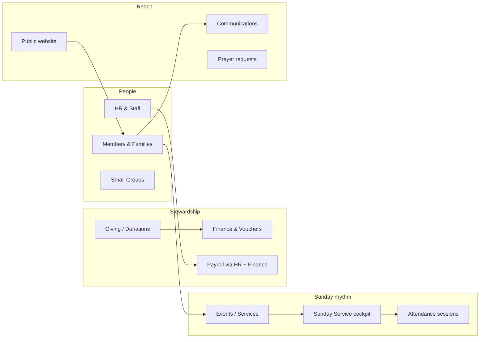

# Grace Community Church — Demo Church Guide

Ultimate Church OS ships with **Grace Community Church**, a fully seeded Chennai congregation for evaluation and training. This guide explains who everyone is, what data exists, and how modules connect—so you can explore without a manual.

**Seed command:** `npm run seed:demo-church:reset` (after `npm run clean:install`)  
**Logins:** See `LOGIN_MATRIX.md` — staff password `demo123` for most roles.

---

## The church at a glance

| Field | Value |
|--------|--------|
| Name | Grace Community Church |
| Location | 42 Church Lane, Anna Nagar, Chennai 600040 |
| Founded | 1998 |
| Tagline | Growing in faith, serving with compassion. |
| Service times | 9:00 AM · 11:30 AM · 5:00 PM (Youth) |
| Contact | office@gracecommunity.in · +91 44 2616 7890 |

**Vision:** A caring Chennai community where every person can know Christ, grow in discipleship, and serve the city with compassion.

---

## How the demo connects (big picture)

- **People** records (members, families, staff) are the spine.
- **Events** (especially `Service` type) power **Sunday Service** live ops and **Attendance**.
- **Giving** feeds **Finance** (ledger, vouchers, budgets).
- **Communications** and **Website** reach members and visitors with the same org identity.

---

## Staff (paid team)

Each staff person has a **member profile**, **HR employment record**, and **login** (where applicable).

| Person | Role | Username | Linked member |
|--------|------|----------|----------------|
| Ravi Nair | Senior Pastor | `pastor` | m01 (Nair family) |
| David Kurian | Associate Pastor | `associate` | m03 (Kurian family) |
| Sarah Thomas | Church Administrator | `churchadmin` | m05 (Thomas family) |
| James Joseph | Finance Manager | `finance` | m07 (Joseph family) |
| Anita George | Youth Pastor | `youth` | m09 (George family) |
| Thomas Menon | Worship Leader | `worship` | m11 (Menon family) |

**Try in product:** HR & Staff → Staff directory · Finance → payroll-related views · Home dashboard with `pastor` vs `finance` logins.

Susan Joseph (`hradmin`) is seeded as HR Manager; Kevin Joseph (`volunteers`) coordinates teams; Priya Paul (`groupleader`) leads a home group.

---

## Families & members

**28 member profiles** span leaders, staff, regular attendees, and visitors. Key households:

| Family key | Household | Notes |
|------------|-----------|--------|
| nair | Ravi & Lakshmi Nair | Senior pastor household |
| kurian | David & Meera Kurian | Associate pastor |
| thomas | Sarah & Philip Thomas | Church admin |
| joseph | James & Susan Joseph | Finance + HR |
| paul | Priya & Arun Paul | Small group leader (Anna Nagar group) |
| cherian | Grace & Ben Cherian | Regular attendees |
| varughese | Arjun & Reena | Kilpauk group leaders |

**Growth stages** in seed data include Leader, Member, Staff, Regular Attendee, and Visitor—useful for testing assimilation and reports.

**Try in product:** Members → open Nair or Paul family · Families module · Pastoral Care for care cases tied to people.

---

## Ministries

| Ministry | Purpose in demo |
|----------|-----------------|
| Worship & Arts | Sunday teams, Thomas Menon |
| Youth Ministry | Youth events, Anita George |
| Children's Ministry | VBS, kids wing events |
| Outreach & Missions | Christmas outreach, community |
| Pastoral Care | Care cases and follow-ups |

Ministries link volunteers and events; coordinators often use **Volunteers** + **Events** together.

---

## Small groups

| Group | Meets | Leader (member) |
|-------|--------|-----------------|
| Grace Home Group — Anna Nagar | Thursday | Priya Paul (m13) |
| Grace Home Group — Kilpauk | Wednesday | Arjun Varughese (m17) |
| Young Adults — City Center | Friday | Joshua George (m25) |
| Married Couples — Church Lane | Saturday | David Kurian (m03) |

**Try in product:** Small Groups · Attendance for group meetings · Login as `groupleader`.

---

## Events & Sunday Service

**Service-type events** (required for Sunday Service module):

- **Sunday Worship — 9:00 AM** (`ev-sunday`) — Main Sanctuary, live ops + run sheet seeded
- **Sunday Worship — 11:30 AM** (`ev-sunday-1130`)

Other calendar items include Wednesday Prayer, Youth Fellowship, Leadership Training, Baptism, Marriage Seminar, VBS, Christmas Outreach, and Easter.

**Sunday run sheet** (9 AM): Pre-service → Worship → Announcements → Message “Walking in Grace” → Response & prayer → Closing worship.

**Try in product:** Sunday Service (select today’s 9 AM service) · Events workspace for planning · Attendance session with check-ins on demo reset.

---

## Donations & finance

Demo seed includes:

- **Gifts** across funds (general, building, missions patterns)
- **Vouchers** in draft / pending approval states for finance UAT
- **Budgets** and fund balances for leadership review

**James Joseph (`finance`)** lands on Finance; **Daniel Nair (`accountant`)** for voucher-heavy workflows.

**Try in product:** Giving → record gift · Finance → Vouchers → Approvals · Budgets → fund vs actual.

---

## Payroll

Staff salaries are defined in seed specs (base, allowances, deductions). HR holds employment records; finance runs payroll posting.

**Try in product:** HR & Staff → directory & leave · Vendors/payroll paths as configured · Finance reconciliation after month-end scenarios.

---

## Prayer requests & communications

- **Prayer requests** appear in Communications (and member portal where enabled).
- **Campaigns** and message history support church-wide or segment outreach.
- **Rachel Thomas (`secretary`)** is the communications manager persona.

**Try in product:** Communications → prayer wall · Campaign list · Member portal prayer (as `member`).

---

## Website

Public site uses CMS content for Grace Community (Chennai), aligned with org profile:

- Service times, vision, contact
- Sermon series: *Walking in Grace*, *Foundations of Faith*, *Family on Mission*

**Try in product:** Website builder in admin · Open `/` without login for public preview.

---

## Recommended evaluation path (~30 minutes)

1. **5 min** — Login as `pastor` → Home → **Explore** (header) or **Academy** → Senior Pastor tour.
2. **10 min** — Login as `churchadmin` → Events, Sunday Service, Volunteers.
3. **10 min** — Login as `finance` → Giving, Finance vouchers, Budgets.
4. **5 min** — Academy → **TEST_MY_CHURCH_OS** checklist; mark items complete.

Progress saves in your browser (localStorage) per device.

---

## Where to go in the app

| Goal | Module | Demo login |
|------|--------|------------|
| Church health | Home | `pastor` |
| Live Sunday | Sunday Service | `pastor`, `worship` |
| People | Members / Families | `churchadmin` |
| Money | Giving / Finance | `finance` |
| Staff | HR & Staff | `hradmin` |
| Learn the product | Academy | Any staff user |

---

*Source of truth for names and IDs: `src/server/scripts/demo-church/churchIdentity.ts` and `seedGraceCommunity.ts`.*
