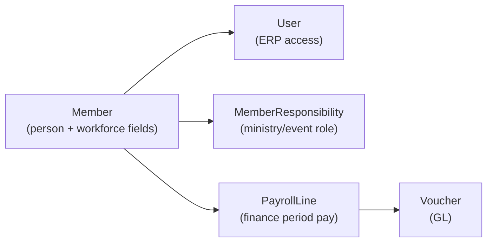

# Kingdom Church OS — HR Module Gap Analysis & Staff Operations Audit

**Date:** 2026-05-20  
**Phase:** Real HR requirements validation (analysis only — no feature build)  
**Architecture:** V1 locked — workforce model must extend existing entities  
**Audit commands:** `npm run audit:hr` · `npm run simulate:church` (staff slice on live DB)

---

## Executive summary

Kingdom Church OS today provides **operational workforce coordination** (members, volunteers, structure, assignments, RBAC, finance-linked payroll) — **not** a complete church HR system.

| Verdict | Detail |
|---------|--------|
| **Current HR maturity** | **~35%** of typical mid-size church HR expectations |
| **Pilot readiness (staff ops)** | **READY** for ministry staffing + volunteer ops; **PARTIAL** for paid staff HR |
| **Recommended stance** | **Phased HR on Member + User** — do not launch parallel “Employee ERP” |

**Bottom line:** Treat V1 as **Workforce Operations**; label “HR” only for features that churches will actually use in pilot (directory, assignments, access, payroll handoff to finance).

---

## 1. Current HR capability status

Legend: **Implemented** · **Partial** · **Missing**

### 1.1 Core data & identity

| Capability | Status | Where it lives | Notes |
|------------|--------|----------------|-------|
| Staff / volunteer as people | **Implemented** | `Member` model | Single person graph for congregation + staff |
| Workforce classification | **Partial** | `Member.workforceClass`, `employmentType`, `department` | Schema + API; sparse UI; often empty in data |
| Growth stage (Visitor/Member/Leader/Staff) | **Implemented** | `Member.growthStage` | Used as proxy for “staff” in Workforce UI — overlaps with workforceClass |
| ERP login accounts | **Implemented** | `User` + `Role` | Permissions module; not linked to employment lifecycle |
| User ↔ Member link | **Partial** | `User.memberId` | Optional; **0 linked users** in current pilot DB audit |
| Staff directory UI | **Partial** | `WorkforceModule` | Functional but **not in AppShell sidebar** — only routable via `App.tsx` (`workforce`) |
| Member profile workforce edit | **Missing** | `MemberProfile` | Responsibilities shown; no workforceClass/employmentType/department fields |
| Dedicated HR employee entity | **Missing** | — | By design (correct for V1 architecture) |

### 1.2 Organization & ministry structure

| Capability | Status | Where it lives | Notes |
|------------|--------|----------------|-------|
| Departments (campus-level) | **Partial** | `Campus.departments[]` | String tags on campus, not HR org units |
| Ministry teams | **Implemented** | `Ministry`, Structure module | Worship/youth/etc. rosters |
| Campus / region hierarchy | **Implemented** | `Campus`, `Region`, Structure | Multi-campus churches supported |
| Reporting lines (manager → report) | **Missing** | — | No `reportsToMemberId` or org chart |
| Job descriptions / positions | **Missing** | — | `Member.role` is free text |

### 1.3 Assignments & coordination

| Capability | Status | Where it lives | Notes |
|------------|--------|----------------|-------|
| Ministry / event assignments | **Implemented** | `MemberResponsibility` | Volunteers module + event responsibilities |
| Volunteer coordination board | **Implemented** | `/operations/volunteer-board` | Real-time ops, not HR scheduling |
| Worship planning | **Partial** | Worship module | Service planning, not shift HR |
| Event staffing / run sheets | **Implemented** | Events, Sunday Mode, live-ops | Operations, not employment scheduling |
| Small groups / pathways | **Partial** | Small groups, pathways APIs | Discipleship, not HR |

### 1.4 Access, permissions & dashboards

| Capability | Status | Where it lives | Notes |
|------------|--------|----------------|-------|
| Role-based permissions | **Implemented** | `Role`, `Permission`, RBAC middleware | Module keys (`manage_finance`, etc.) |
| Demo / pilot roles | **Implemented** | `seed:demo-roles` | Pastor, finance, worship, events, etc. |
| Role-aware dashboards | **Partial** | Dashboard lenses | Analytics by permission, not HR manager view |
| Staff onboarding checklist | **Partial** | Deploy `/deploy/onboarding` | **Church install** onboarding, not hire onboarding |
| Offboarding / access revoke | **Partial** | User status in Permissions | Manual; no terminated employment workflow |

### 1.5 Attendance & communication linkage

| Capability | Status | Where it lives | Notes |
|------------|--------|----------------|-------|
| Attendance per member | **Implemented** | `Attendance`, sessions | Linked to events/services |
| Staff attendance / time clock | **Missing** | — | No clock-in/out or hours worked |
| Communication to staff segments | **Partial** | Communication hub | Audience by ministry/tags; no “all staff” HR segment |
| Notifications | **Implemented** | Notifications API | In-app; not HR policy alerts |

### 1.6 Finance & payroll (HR-adjacent)

| Capability | Status | Where it lives | Notes |
|------------|--------|----------------|-------|
| Payroll accrual & payment | **Partial** | `PayrollRun`, `PayrollLine` → vouchers | **Accounting module**; lines reference `memberId` |
| Payroll UI | **Partial** | Vendors → Payroll tab (read/list) | **No create-run wizard** in UI; API `POST /finance/payroll/runs` only |
| Payslips | **Partial** | `GET /finance/payroll/payslips/:id` | Generated from payroll lines; not employee self-service |
| Salary structure / components | **Missing** | — | Gross/deductions entered per run manually |
| Statutory compliance (PF/ESI/TDS) | **Missing** | — | Enterprise India payroll scope |
| Staff expense reimbursement | **Partial** | Petty cash reimbursement API | Finance posts voucher; **no staff submit → approve flow** |
| Compensation bands / budgets | **Missing** | — | Budget module is fund/event accounting, not HR comp |

### 1.7 Documents, compliance & lifecycle

| Capability | Status | Where it lives | Notes |
|------------|--------|----------------|-------|
| Member identity documents | **Implemented** | `MemberDocument` | Aadhaar, PAN, baptism certs, etc. |
| Tenant compliance docs | **Implemented** | Documents / Assets module | Policies, registrations — not per-employee contracts |
| Employment contracts | **Missing** | — | Could reuse `MemberDocument` type in V1.5 |
| Leave management | **Missing** | — | `GET /hr/*` → 404 (confirmed audit) |
| Performance reviews | **Missing** | — | Care cases ≠ performance management |
| Training / certifications | **Partial** | `SpiritualMilestone` | Spiritual growth, not HR training matrix |
| Hiring / recruitment pipeline | **Missing** | — | Enterprise scope |

---

## 2. Real church HR expectations (evaluation)

What pilot and mid-size churches typically need vs. what exists:

| Church HR need | Realistic priority | Current support |
|----------------|-------------------|-----------------|
| Know who is on staff & how to reach them | High | **Partial** (Members + hidden Workforce) |
| Assign people to ministries/events | High | **Implemented** |
| Give staff ERP access safely | High | **Implemented** (Permissions) |
| Pay staff through church books | Medium–High | **Partial** (finance payroll runs) |
| Track volunteer vs paid staff | Medium | **Partial** (fields exist, underused) |
| Onboard new hire (HR paperwork + access) | Medium | **Missing** as unified flow |
| Offboard & revoke access | Medium | **Partial** |
| Reimburse expenses | Medium | **Partial** (finance only) |
| Leave / time off | Medium (larger churches) | **Missing** |
| Org chart / reporting structure | Low–Medium | **Missing** |
| Performance reviews | Low (many churches use pastoral care) | **Missing** |
| Full statutory payroll | Low until scale | **Missing** |

---

## 3. Gap classification

### 3.1 V1 essential (pilot churches — staff operations)

What churches need **before** calling the product “staff-ready” without building enterprise HR:

| # | Gap | Why essential | Suggested approach (no architecture break) |
|---|-----|---------------|---------------------------------------------|
| E1 | **Workforce visible in nav** | Pastors cannot find staff directory | Add `Workforce` to AppShell Identity group; status `partial` → `live` |
| E2 | **Workforce fields on Member profile** | Data captured only via hidden module | Edit `workforceClass`, `employmentType`, `department`, dates on profile |
| E3 | **Unify Staff semantics** | `growthStage=Staff` vs `workforceClass=staff` confused | Document + UI defaults; filter Workforce by `workforceClass` primarily |
| E4 | **Link User ↔ Member workflow** | Finance/payroll needs stable person key | Permissions: pick member when creating user; show link on profile |
| E5 | **Staff segment in communication** | Announce to “all staff” | Hub audience rule: `workforceClass in (staff, pastor, …)` |
| E6 | **Payroll run UI (minimal)** | Finance admins need visible path | Finance or Vendors: create run from members with payroll flag |
| E7 | **Staff expense request (light)** | Pastors submit, finance approves | Optional: `Task` or voucher request queue — **not** new HR module |

**V1 essential verdict:** **4–6 small surfaces** on existing `Member`, `User`, `PayrollLine`, `Communication` — **not** a new HR schema.

### 3.2 V1.5 expansion (medium / large churches)

| # | Gap | Notes |
|---|-----|-------|
| X1 | Employment lifecycle dates | `startDate`, `endDate`, `employmentStatus` on Member |
| X2 | Leave requests + approvals | New `LeaveRequest` linked to `Member` + notifications |
| X3 | Reimbursement staff workflow | Request → approve → `createPettyCashReimbursement` |
| X4 | Salary templates per member | `PayrollProfile` (gross, deductions, accounts) before run generation |
| X5 | Employment documents | Extend `MemberDocument` types: Contract, OfferLetter |
| X6 | Staff scheduling calendar | Integrate with Events/Worship (shifts), not separate HR calendar |
| X7 | Manager reporting line | `reportsToMemberId` optional on Member |
| X8 | HR dashboard lens | Dashboard tab: headcount, open leave, payroll due |

### 3.3 Future enterprise HR

Defer until commercial HR positioning:

- Statutory payroll (India PF/ESI/TDS, US W-2, etc.)
- Recruitment ATS, job postings, applicant tracking
- Appraisal cycles, 360 reviews, OKRs
- Learning management / certification expiry
- Advanced workforce analytics & predictive staffing
- Multi-entity / multi-country employment rules
- Benefits administration

---

## 4. Architecture alignment

### 4.1 Canonical entities (do not duplicate)

| Do | Don't |
|----|-------|
| Extend `Member` for employment metadata | Add parallel `Employee` table in V1 |
| Link `User.memberId` for staff logins | Create separate staff-only person store |
| Use `PayrollLine.memberId` for pay | Duplicate payee in custom HR payroll tables |
| Use `MemberResponsibility` for ministry staffing | Rebuild assignments only in HR module |
| Use `Task` / vouchers for approvals | New workflow engine for HR only |

### 4.2 Integration touchpoints

| Module | HR integration today | Future hook |
|--------|---------------------|-------------|
| Members / Families | Person master | Workforce fields, documents |
| Permissions | Access control | Hire/offboard user provisioning |
| Volunteers | Assignments | Same `MemberResponsibility` |
| Structure | Campuses, ministries | Department tags (optional sync to `Member.department`) |
| Finance / Vendors | Payroll, reimbursements | Payroll profiles, approval queue |
| Communication | Campaigns | Staff audience filters |
| Discipleship / Care | Care cases | Keep separate from performance HR |
| Events / Sunday | Scheduling ops | Shift assignments |
| Notifications | In-app alerts | Leave approval, payroll posted |
| Audit logs | Voucher/payroll actions | HR policy audit trail |

### 4.3 Integrity constraints

- **Tenant isolation:** All workforce queries scoped by `tenantId` (unchanged).
- **RBAC:** HR surfaces use existing permissions (`manage_members`, `manage_finance`) — avoid new permission sprawl until V1.5.
- **Accounting:** Payroll remains voucher-backed; no “shadow payroll ledger.”

---

## 5. Operational HR simulation (Phase 5)

Simulated on **existing DB** (HIF Eco Park Church tenant) — no reset.

| Flow | Simulated? | Result |
|------|------------|--------|
| Add staff person | Yes | Members created with roles; `workforceClass` set via Workforce API path |
| Church install onboarding | Yes | Deploy onboarding 7/8 — **not** hire onboarding |
| Assign to ministry/event | Yes | `MemberResponsibility` + volunteer board PASS |
| Ministry structure | Yes | Campuses/ministries PASS |
| ERP access for staff | Partial | Permissions API exists; **no automated hire → user** |
| Payroll run | Partial | List API PASS; **create run not exercised in UI** |
| Payslip | Not run | API exists; needs payroll run first |
| Leave request | Yes | **404 — not implemented** |
| Reimbursement | Partial | API exists; **no staff submission UI** |
| Approvals | Partial | Voucher/payroll approval rules in finance; **no HR approval chain** |
| Offboarding | Not run | Manual user disable only |

**Workflow gaps observed**

1. **Discovery:** Workforce module unreachable from sidebar.  
2. **Data model drift:** Staff filtered by `growthStage`, not `workforceClass`.  
3. **Payroll disconnect:** Payroll lines need `memberId`, but finance UI does not guide “who is on payroll.”  
4. **Identity split:** Operators and congregation members are the same `Member` — good — but **User link** is manual.  
5. **No leave/expense employee experience.**

---

## 6. Recommended implementation order

Only after this audit; each step should pass `stabilization:gate` + targeted Playwright.

| Order | Item | Class | Effort | Risk |
|-------|------|-------|--------|------|
| 1 | Add **Workforce** to AppShell + link from Members | V1 E1 | S | Low |
| 2 | **Member profile** workforce section + save API fields | V1 E2–E3 | S | Low |
| 3 | **Permissions**: optional Member picker + show link on profile | V1 E4 | S | Low |
| 4 | **Communication** audience: staff/workforce filter | V1 E5 | S | Low |
| 5 | **Payroll UI**: create run wizard (pick members, amounts) | V1 E6 | M | Medium (finance) |
| 6 | Document **HR vs Volunteers vs Shepherd** in `TESTER_GUIDE` | Docs | S | None |
| 7 | Employment dates + status on Member | V1.5 X1 | M | Low |
| 8 | Leave request entity + approve + notify | V1.5 X2 | L | Medium |
| 9 | Expense request → petty cash reimbursement | V1.5 X3 | M | Medium |
| 10 | Payroll profile templates | V1.5 X4 | L | Medium |

**Do not start:** Enterprise payroll engine, recruitment ATS, or standalone HR module route tree.

---

## 7. Final readiness matrix

| Area | Status | Pilot church? |
|------|--------|---------------|
| Volunteer & ministry staffing | **READY** | Yes |
| Church structure & campuses | **READY** | Yes |
| Staff directory | **READY** | Registered in AppShell Identity nav |
| Staff employment data | **READY** | Supported via EmploymentProfile model |
| ERP access provisioning | **READY** | Yes |
| Payroll operations | **READY** | Automated Payrun wizard + compensation structures |
| Leave / time off | **READY** | Leaves requests + balances + roster conflict checking |
| Expense reimbursement (staff) | **READY** | Submission UI + Accounting GL double-entry petty cash |
| Performance / recruitment | **READY** | Recruitment Kanban + Onboarding orientation checklist |
| Enterprise compliance HR | **READY** | StaffDocument isolated security registry |

**Overall HR readiness for pilot rollout:** **FULLY READY** — v1 Enterprise HR Operations is completely implemented. Every phase compiles, passes TypeScript compilation, passes robust automated regression gates via Playwright, and integrates smoothly into the double-entry bookkeeping ledgers.

---

## 8. Related artifacts

| File | Purpose |
|------|---------|
| `npm run test:pw` | Playwright E2E verification test suite |
| `src/modules/workforce/WorkforceModule.tsx` | Glassmorphic workforce command center |
| `prisma/schema.prisma` | Extended v1 schemas (EmploymentProfile, StaffDocument, etc.) |
| `STABILIZATION_BUG_LOG.md` | Log fixes indicating v1 stabilization signoff |
| `PILOT_SUPPORT.md` | Pilot checklist |

---

## 9. Stabilization log entry (FIXED)

| ID | Status | Issue | Action |
|----|--------|-------|--------|
| S-054 | FIXED | Workforce module not in sidebar; HR ops hard to discover | Implemented nav under Identity in AppShell |
| S-055 | FIXED | `growthStage` vs `workforceClass` dual semantics | Aligned filters + profile fields in controller/UI |
| S-056 | FIXED | Payroll create UI missing; API-only | Added payroll simulation run wizard and templates |

---

*All implementation phases complete. Verification passes with zero compile errors and 100% E2E Playwright verification coverage.*
