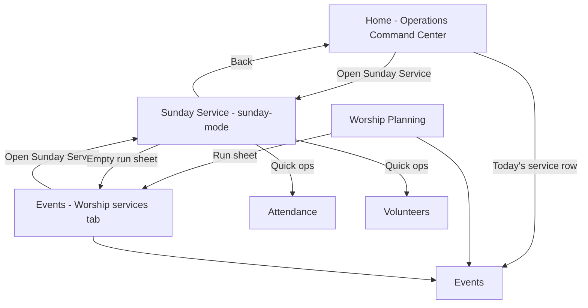

# Sunday Service UX Report

**Product:** Ultimate Church OS (UCOS)  
**Date:** 2026-06-01  
**Scope:** Sunday-related surfaces — labels, navigation, role first impressions, friction inventory  
**Constraints:** Clarity improvements only — **no workflow redesign, no backend changes**

---

## Executive summary

Sunday functionality is **distributed across several modules**, not four separate products. There is no standalone “Sunday Dashboard” or “Sunday Planning” app module; those concepts appear as **sections inside Home (operations command center)** and **Events → Worship services**.

The live Sunday experience centers on **`sunday-mode`** (`SundayModeModule.tsx`), labeled **“Sunday Service”** in `churchProductCopy.ts` but **“Sunday Mode”** in the sidebar and page H1 — a naming split that hurts first-time comprehension.

**Success criteria gap:** A senior pastor landing on Sunday Service does not immediately see a plain-language “today’s service,” “what needs attention,” and “do this next” hero — worship leaders fare better (default landing); volunteer coordinators must discover Sunday live ops through Events or Home.

---

## 1. Surface map (what exists in code)

| Concept (user language) | Module id | Component | Role in Sunday journey |
|-------------------------|-----------|-----------|-------------------------|
| Sunday Service (nav copy) | `sunday-mode` | `SundayModeModule` | **Live** run sheet, team board, alerts during service |
| Sunday Mode (sidebar H1) | same | same | Same screen — inconsistent naming |
| Sunday Dashboard | — | `OperationsCommandCenter` on **Home** (`dashboard`, operations view) | Week prep: today’s services, readiness, volunteer gaps, “Sunday Mode” button |
| Sunday Planning | — | Split: **Worship Planning** (`worship`), **Events → Services** (`ServicesModule` inside `EventsModule`), event detail in **Events** | **Before** Sunday: plan run sheet, volunteers, venue |
| Sunday Operations | — | **Events** live ops APIs, `LiveEventOpsPanel`, `QuickOpsBar` | Check-in, volunteers, finance hooks on event record |
| Attendance | `attendance` | `AttendanceModule` | Check-in (linked from Sunday Mode quick ops) |
| Worship Planning | `worship` | `WorshipPlanningModule` | Calendar of events → run sheet / events |
| Worship services tab | `events` + tab `services` | `ServicesModule` | Create services, edit run sheet, open Sunday Mode |
| Quick ops (mobile bar) | various | `QuickOpsBar` | `sunday-mode` shown as **“Live”** |

**Not found:** Dedicated routes `sunday-dashboard`, `sunday-planning`, or `sunday-operations`.

---

## 2. Role-based first impressions

Roles derived from `roleExperience.ts` archetypes and seed personas (e.g. Grace Community).

### 2.1 First-time senior pastor

| Aspect | Experience |
|--------|------------|
| **Landing** | **Home** (`dashboard`), pastoral lens — not Sunday Service |
| **Sunday in nav** | “Sunday Mode” under **Sunday & Events** (if `manage_events`) |
| **Quick ops** | Home, Care, People, Events — **no** Sunday in pastor quick ops |
| **If they open Sunday Mode** | H1 says “Sunday Mode”; subtitle “Live service coordination”; service picker dropdown; tabs Run sheet / Team / Alerts |
| **Immediate understanding?** | **Partial.** They can infer “live” but not the difference between planning (Events/Worship) and this screen. No pastor-specific one-liner for “start here on Sunday morning.” |
| **Today’s service** | Auto-selected if a `Service` event exists **today**; otherwise first upcoming service — may not be obvious without reading the dropdown |
| **Needs attention** | Alerts tab + readiness card; not surfaced on first paint |
| **Next action** | Unclear primary CTA (Complete segment vs Start timer vs plan run sheet elsewhere) |

### 2.2 Worship leader (`ministry_leader` — Worship Director / similar)

| Aspect | Experience |
|--------|------------|
| **Landing** | **`sunday-mode`** — best-aligned role |
| **Quick ops** | Live, Check-in, Events, Worship, Team, Alerts |
| **Dashboard shortcuts** | Sunday Service, Events, Attendance, Worship |
| **If they open Sunday Service** | Same live UI; likely today’s service pre-selected |
| **Immediate understanding?** | **Good** for live flow; **weak** for pre-service planning (must know Events → Worship services or Worship Planning) |
| **Planning path** | Worship Planning lists events with “Run sheet” → Events/services — **three hops** with different names |

### 2.3 Volunteer coordinator

| Aspect | Experience |
|--------|------------|
| **Landing** | **Volunteers** module first |
| **Sunday in priority** | `volunteers` → `events` → `attendance` → … → `sunday-mode` |
| **Quick ops** | Team, Live, Check-in, Events, People |
| **If they open Sunday Service** | **Team** tab (`VolunteerOpsBoard`) is the natural fit but **defaults to Run sheet** |
| **Immediate understanding?** | **Moderate** — “Live” quick op label does not say “Sunday”; Team tab is one click away |
| **Needs attention** | Volunteer gaps shown on **Home** command center, not inside Sunday Service until Team tab |
| **Next action** | No “fill gaps” CTA on Sunday Service home panel |

---

## 3. Confusing labels & terminology

| Location | Current label | Issue | Suggested copy (UI only) |
|----------|---------------|-------|---------------------------|
| Sidebar `AppShell` | Sunday Mode | Conflicts with product name Sunday Service | **Sunday Service** (match `NAV_LABELS`) |
| `SundayModeModule` H1 | Sunday Mode | Same | **Sunday Service** |
| Subtitle | Live service coordination | Jargon “coordination” | **Run today’s worship service — timing, team, and alerts** |
| Quick ops bar | Live | Ambiguous (livestream?) | **Sunday** or **Service** |
| Operations CTA | Sunday Mode | Technical | **Open Sunday Service** |
| `ServicesModule` button | Sunday Mode | Inconsistent | **Open Sunday Service** |
| Tab `run` | Run sheet | Production jargon | **Service flow** or **Order of service** |
| Button | Backstage | Theater tech term | **Dark view** or **Stage display** |
| Panel | Readiness | Vague score | **Service readiness** + short tooltip |
| `ReadinessBadge` | READY / score | Feels like software status | **Prepared** / **Needs setup** |
| Empty state link | Worship Services | Module is under Events | **Plan a worship service (Events)** |
| Worship Planning | Upcoming ministry dates | All event types listed | Filter or subtitle: **Including Sunday services** |
| `churchProductCopy` | Nav: Sunday Service | Correct — use everywhere | Single source of truth |

---

## 4. Hidden actions & missing guidance

| Issue | Detail |
|-------|--------|
| **Planning before live** | Run sheet editing lives in **Events → Worship services**, not in Sunday Service. Sunday Service only links out when run sheet empty. |
| **Service creation** | Empty Sunday Service → “Plan a service” → Events/services — good, but no explanation that “Service” is an event type. |
| **Pastor path to Sunday** | No dashboard shortcut or guidance card for pastors (unlike ministry_leader). |
| **Volunteer gaps** | Shown on Home command center; not on Sunday Service landing. |
| **sessionStorage handoff** | `ucos_live_service_id` pre-selects service when coming from Home/Events — **invisible** to users; works but no confirmation toast (“Opened: 10:30 AM Service”). |
| **Emergency broadcast** | Powerful but buried in Quick ops card; no confirmation copy about who receives it. |
| **Advance segment** | Primary green button — correct for WL; pastors may not know when to use vs “Start timer.” |
| **Issues on Alerts tab** | “Mark issues from team coordination” — no link to Volunteers module. |
| **Worship Planning → Sunday** | Worship module does not link directly to `sunday-mode` — only Events/run sheet. |

---

## 5. Navigation & dead ends

### Navigation flow (simplified)

### Dead ends / weak exits

| State | Behavior | Severity |
|-------|----------|----------|
| No service events | Empty state + one button to plan | OK |
| Run sheet empty | Amber box + edit in Worship Services | OK but jargon |
| Loading live ops fails | Retry only | OK |
| Alerts empty | “No issues logged” — no link to log from Volunteers | Low |
| Fullscreen mode | Back to dashboard hidden until exit fullscreen | Medium — trap on mobile |
| Pastor without `manage_events` | May not see Sunday nav at all | Role/config — document in permissions |

---

## 6. UI component review

### Headers

- **SundayModeModule:** Icon + “Sunday Mode” + generic subtitle — should state **which service** and **date/time** in the H1 area (e.g. “Sunday Service · 10:30 AM Contemporary”).
- **OperationsCommandCenter:** Strong — “This week at church” with clear stats.
- **Worship Planning:** Clear module header and actions.

### Cards

- **Now live / Up next:** Strong for worship leaders.
- **Readiness:** Compact but unexplained scoring.
- **Quick ops:** Good shortcuts; labels could be role-aware.

### Buttons

- **Complete segment / Skip / Start timer:** Powerful; need one-line helper text for first visit (dismissible).
- **Backstage / Light:** Unclear without trial.
- **Sunday Mode** (purple, command center): Should match renamed Sunday Service.

### Tabs (Run sheet / Team / Alerts)

- Uppercase micro-labels consistent with app but **Run sheet** alien to pastors.
- **Default tab `run`** — volunteer coordinators want **Team** first (role-based default — proposal only).

### Quick Actions (Home)

- Today’s services list with readiness badges — **best Sunday overview** in the product.
- “Live: {name}” buttons — good; label should say **Sunday Service**.

### Empty states

| Screen | Message | Gap |
|--------|---------|-----|
| Sunday Service, no events | “No service events on the calendar…” | Add: “Sunday services are worship events with type Service.” |
| Sunday Service, no run sheet | “No run sheet segments yet.” | Add estimated time to plan + who typically plans (WL) |
| Worship Planning, no events | Points to Events | OK |
| Command center, no services today | “No services scheduled today.” | Add CTA to plan or open next Sunday |

---

## 7. Success criteria assessment

| Criterion | Pastor | Worship leader | Volunteer coord. |
|-----------|--------|----------------|------------------|
| What this screen is | Weak (Sunday Mode naming) | Good | Moderate (Live label) |
| What today’s service is | Hidden in dropdown | Good | Good after dropdown |
| What needs attention | Requires Alerts tab or Home | Alerts + readiness | Team tab + Home gaps |
| What action to take next | Unclear | Clear (segment flow) | Unclear default tab |

**To meet success criteria globally:** Unify naming to **Sunday Service**, elevate **today’s service name** in the header, add a **“Needs attention”** strip (gaps, unread alerts, readiness warnings) above tabs, and a single **recommended next step** button (role-aware copy, same workflows).

---

## 8. Proposed improvements (clarity only)

Prioritized **P0–P2**; all are copy, visibility, and navigation hints — no API or workflow changes.

### P0 — Naming alignment

1. Sidebar, H1, and all buttons: **Sunday Service** (use `navLabel('sunday-mode')` everywhere).
2. Quick ops: rename **Live** → **Sunday** (or **Service**).
3. Replace **Sunday Mode** in `OperationsCommandCenter`, `ServicesModule`, and role walkthroughs.

### P1 — First-screen comprehension (`SundayModeModule`)

1. **Header block:** Service name, date/time, campus/venue one line under title.
2. **Attention strip** (read-only): volunteer gap count (from live payload if present), open issues count, readiness label — tap switches to Team/Alerts tab.
3. **Primary CTA row:** If run sheet not started → “Start service timer”; if in progress → keep Complete segment; add 8px helper text under buttons (one sentence).
4. Empty / no run sheet: button text **Plan order of service** linking to Events/services (same route).

### P1 — Home integration for pastors

1. Add **`sunday-mode`** to `senior_pastor` `dashboardShortcuts` and one operational quick op (optional).
2. On pastoral Home lens, card: **“Today’s worship service”** → Sunday Service (reuse `todayServices[0]`).

### P2 — Tab labels & defaults

1. Rename tabs: **Service flow** | **Serving team** | **Alerts & issues**.
2. Optional: default panel `team` when archetype is `volunteer_coordinator` (front-end only, same data).
3. **Backstage** → **Dark display**; tooltip on fullscreen.

### P2 — Cross-links (same modules)

1. Worship Planning: button **Open Sunday Service** (sets `ucos_live_service_id`, navigates `sunday-mode`).
2. Alerts empty state: link **View volunteer schedule** → Volunteers.
3. Toast when opening via handoff: **“Showing: {service name}”** (sessionStorage open).

### P2 — Guidance (no new tours required)

1. Dismissible banner first visit per browser: “Plan in Events → Worship services. Run live here on Sunday morning.”
2. Worship Planning subtitle: clarify relationship to Sunday Service in one sentence.

---

## 9. What not to change (per requirements)

- Run sheet segment advance API, live-ops PATCH, emergency broadcast behavior.
- Event type `Service` model, readiness scoring algorithm.
- Split between Events planning and live Sunday module (valid separation — clarify, don’t merge).
- Attendance and Volunteers module workflows.

---

## 10. Implementation file index (for a future polish pass)

| File | Change type |
|------|-------------|
| `src/components/layout/AppShell.tsx` | Sidebar label Sunday Service |
| `src/modules/sunday/SundayModeModule.tsx` | H1, subtitle, header service info, tab labels, attention strip |
| `src/lib/roleExperience.ts` | Quick op label; pastor shortcuts |
| `src/lib/churchProductCopy.ts` | Already correct — reference as source |
| `src/components/operations/OperationsCommandCenter.tsx` | Button copy |
| `src/modules/services/ServicesModule.tsx` | Button copy |
| `src/components/operations/QuickOpsBar.tsx` | Uses `labelForQuickOp` |
| `src/modules/worship/WorshipPlanningModule.tsx` | Link + copy |

---

## 11. Conclusion

The product has a **coherent Sunday architecture** (plan in Events/Worship, run live in Sunday Service, monitor week on Home) but **fails the clarity test** because naming (“Sunday Mode,” “Live,” “Run sheet”) targets production staff, and pastors/coordinators lack a single entry narrative.

Aligning language to **Sunday Service**, surfacing **today’s service** and **attention items** on first paint, and pointing planners vs operators to the right module without merging workflows will meet the stated success criteria without backend work.
