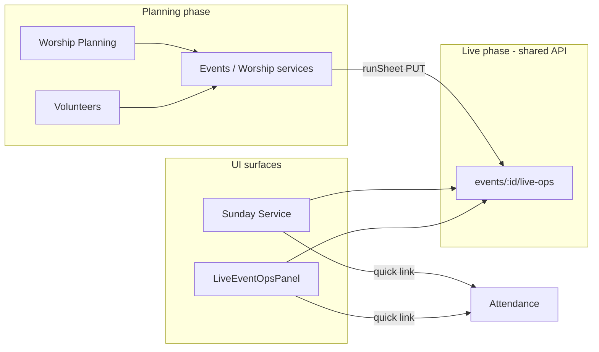

# Sunday Service — Operational Value Review

**Product:** Ultimate Church OS (UCOS)  
**Date:** 2026-06-01  
**Question:** Does **Sunday Service** (`sunday-mode` / `SundayModeModule`) provide unique operational value, or is it duplicate navigation over Events / Worship / Volunteers / Attendance?

---

## Executive recommendation

| Verdict | Scope |
|---------|--------|
| **KEEP** | Sunday Service as a **dedicated live cockpit** module (nav entry + fullscreen UX) |
| **MERGE (future)** | Overlap with **Events → Live operations** panel (`LiveEventOpsPanel`) — same APIs, two UIs |
| **REMOVE** | **Not recommended** — would drop the only segment-timer / advance workflow UI without replacing it |

**Evidence summary:** Backend capabilities are **shared** (`events/:id/live-ops`). Sunday Service’s value is **concentrated UX for service morning**, not exclusive data or APIs. It is **most valuable during live worship**; planning belongs elsewhere. A **normal church can operate without it** if staff use Events live ops + Attendance, but they lose the purpose-built Sunday flow.

---

## Module comparison matrix

| Capability | Sunday Service | Events (+ EventWorkspace / LiveEventOpsPanel) | Worship Planning | Attendance | Volunteers |
|------------|----------------|-----------------------------------------------|------------------|------------|------------|
| Create / edit service events | Links out | Yes | Links out | — | — |
| Edit order of service (run sheet) | Links to Events → services | Yes (`run-sheet` PUT, EventWorkspace) | Links to run sheet | — | — |
| **Advance segments + timer** | **Yes** (`POST live-ops/advance`, countdown UI) | **No** (no advance UI in LiveEventOpsPanel) | No | No | No |
| Fullscreen / dark “stage” view | Yes | No | No | No | No |
| Volunteer presence board (live) | Yes (Team tab) | Yes (LiveEventOpsPanel) | No | No | Yes (roster + assign; board via `volunteer-board` API) |
| Media / stream ready toggles | Yes | Yes | No | No | No |
| Log operational issues | Yes (Alerts tab) | Yes (display in LiveEventOpsPanel) | No | No | No |
| Emergency broadcast to ops | Yes (`live-ops/emergency`) | No button in panel | No | No | No |
| Check-in / sessions | Quick link | Link | Quick link | **Yes (canonical)** | — |
| Realtime websocket refresh | Yes | Yes | No | Partial | No |
| Agenda sessions (multi-block) | No | **Yes** (SortableAgendaSessions) | No | No | No |
| Attendance metrics on live payload | Yes (from linked sessions) | Yes | No | Yes (source) | No |
| Pastoral “attention / next step” strip | Yes (UI-only) | No | No | No | No |

**Source files:** `SundayModeModule.tsx`, `LiveEventOpsPanel.tsx`, `LiveOpsService.ts`, `ServicesModule.tsx`, `WorshipPlanningModule.tsx`, `AttendanceModule.tsx`, `VolunteersModule.tsx`, `VolunteerOpsBoard.tsx`.

---

## Answers to review questions

### 1. What can Sunday Service do that no other module can do?

**Unique in the product today (UI, not backend):**

1. **Live segment driver** — “Now live” / “Up next”, segment countdown, **Complete segment**, **Skip**, **Start timer** wired to `POST /events/:id/live-ops/advance` (`SundayModeModule.tsx` ~295–321). No other screen exposes this flow.
2. **Fullscreen + dark view** — intended for platform / stage-side use during worship.
3. **Single-purpose Sunday cockpit** — attention summary + suggested next step + three tabs optimized for **flow / team / alerts** in one scroll path.
4. **Inline emergency broadcast** — `live-ops/emergency` with notification to admins (`LiveOpsService.triggerEmergency`).

**Not unique (available elsewhere):**

- Run sheet data → edited in **Events / Worship services** (`ServicesModule`, `EventWorkspace`).
- Volunteer check-in state → same `VolunteerOpsBoard` + `volunteerPresence` patch as **Events live ops**.
- Media/stream flags → same `PUT live-ops` as **LiveEventOpsPanel**.
- Attendance → **Attendance** module (Sunday only deep-links).

**Conclusion:** Sunday Service is the **only live segment conductor UI**; everything else is either planning, check-in, or duplicate live-ops surfacing.

---

### 2. Is it required for a normal church?

**No — not strictly required.**

A church with basic digital maturity can:

- Plan services in **Events** (type `Service`),
- Check people in via **Attendance**,
- Assign volunteers in **Volunteers**,
- Optionally open **Events → Live operations** for team + media toggles.

They **cannot** advance the run sheet segment-by-segment with timer **without** Sunday Service (or a future merged live view) unless they use spreadsheets or paper.

**Required for:** churches that want **in-app live worship timing** and a **single “service morning” screen** for pastors / worship leaders / coordinators.

**Not required for:** churches that only need calendar + attendance + volunteer lists.

---

### 3. Is it only useful during a live service?

**Primarily yes.**

| Phase | Best module | Sunday Service role |
|-------|-------------|---------------------|
| Weeks before | Events, Worship Planning | Empty or misleading if opened with no `Service` events |
| Day before | Events, Volunteers, Home command center | Optional prep via readiness elsewhere |
| **During service** | **Sunday Service** | **Primary value** |
| After service | Attendance (close session), Events (COMPLETED) | Low; historical data lives on event + sessions |

The module **auto-selects today’s `Service` event** (`SundayModeModule` filters `type === 'Service'`). Outside live windows it still functions as a **read-only-ish ops dashboard** but feels redundant next to Home / Events.

---

### 4. Is it duplicate functionality?

**Partially yes — structurally duplicate, experientially differentiated.**

| Layer | Duplication |
|-------|-------------|
| **API** | 100% shared `live-ops` on `Event` (`opsConfig`, `runSheet` JSON) |
| **Volunteer board** | Shared component `VolunteerOpsBoard` |
| **UI** | ~40% overlap with `LiveEventOpsPanel` (media, stream, issues, team, link to Sunday Service) |
| **Navigation** | Overlaps **Events**, **Worship services** tab, **Home** “Sunday Service” buttons |

**Not duplicate:** segment advance + fullscreen + Sunday-specific attention UX.

---

### 5. Could it be merged into Worship Planning?

**Not ideal as the merge target.**

| Worship Planning actual role | Evidence |
|------------------------------|----------|
| Calendar of **all** event types | `WorshipPlanningModule` lists every event, not only services |
| No `live-ops` calls | Read-only + navigation |
| Explicit copy: run sheet in **Worship services** | Card footer in module |

Worship Planning is **pre-service alignment** (dates, links). Live ops are **time-critical** and belong next to **Events** or a **“Go live”** mode.

**Better merge target:** **Events → Live operations** tab (embed `SundayModeModule` run/team/alerts or promote panel to full page). Worship Planning would keep a **“Open Sunday Service”** link only.

---

### 6. Would removing it simplify the product?

**Yes for navigation; no for operators.**

| If removed | Effect |
|------------|--------|
| Sidebar / quick ops | −1 item; less “where do I go Sunday morning?” |
| Worship / youth landing | `ministry_leader` defaults to `sunday-mode` — would need new landing |
| Capability gap | Segment timer / advance **gone** unless rebuilt in Events |
| Workaround | `LiveEventOpsPanel` + external timing | 

**Simplification score:** Nav **+1**, operational clarity for live Sunday **−2**.

---

## KEEP / MERGE / REMOVE (with evidence)

### KEEP

**Sunday Service as a first-class module** for:

- Live segment control (only UI for `advanceLiveSegment`).
- Role landing for worship/ministry (`roleExperience.ts` → `landingModule: 'sunday-mode'`).
- Reduced cognitive load vs drilling Events → event → Live ops → Open Sunday Service.

**Evidence:** `event.routes.ts` exposes advance/emergency; only `SundayModeModule` consumes advance in the frontend (grep `live-ops/advance` → single module).

---

### MERGE (recommended follow-up, not this review’s scope)

**Consolidate duplicate live-ops UI** into one surface:

- Option A: Events **Live** tab = full Sunday Service layout; remove sidebar duplicate for users who live in Events.
- Option B: Sunday Service remains nav entry; **remove** redundant controls from `LiveEventOpsPanel` (keep agenda editor only in Events).

**Do not merge into Worship Planning** — different lifecycle phase (plan vs run).

---

### REMOVE

**Do not remove** unless product accepts losing:

- Segment timer workflow
- Fullscreen ops view
- Dedicated Sunday morning entry point

Removing without merging **regresses** ministry_leader and operational-scenario tests (`operational-scenario-simulation.ts` hits `live-ops`).

---

## Demo seed — realistic active Sunday Service

### Problem found

Grace Community seed had `ev-sunday` with `type: 'Worship'`, while Sunday Service filters **`type === 'Service'`** — the demo church showed an **empty** Sunday Service until fixed.

### Seed updates (implemented)

| Item | Detail |
|------|--------|
| Events | `ev-sunday` **9:00 AM** and `ev-sunday-1130` **11:30 AM**, both `type: Service`, dated **today** |
| Run sheet | 6 segments (`SUNDAY_SERVICE_RUN_SHEET` in `churchIdentity.ts`) |
| Live state | `opsConfig`: active segment index 1, timer started, media ready, stream not ready, 1 issue, volunteer presence mix |
| Status | Primary service `ACTIVE` |
| Volunteers | 5 roles on 9 AM + 2 on 11:30 |
| Attendance | **OPEN** session `session-sun-live-today` with **14** check-ins for live metrics |

### How to load demo data

```bash
# From repo root — re-seed Grace Community (or full clean install)
npm run seed:demo-church:reset
# or
npm run clean:install
```

### How to evaluate the screen

1. Log in as **admin** or **worship** user with `manage_events` (e.g. Grace Community seed credentials from `LOGIN_MATRIX.md`).
2. Open **Sunday Service** in sidebar (or Home → **Sunday Service: Sunday Worship — 9:00 AM**).
3. **Expected within 5 seconds:**
   - Title **Sunday Service** + tagline
   - **Active: Sunday Worship — 9:00 AM · Today · 9:00 AM**
   - Attention: stream not ready + open issue (mic battery)
   - **Suggested next step** referencing current segment **Worship set**
   - **Service flow** tab: segment timer, Complete / Skip / Start timer
   - **Serving team** tab: 5 assignments with presence states
   - **Alerts** tab: mic issue logged

4. **Cross-check (not duplicate paths):**
   - **Events** → same event → Live operations → same volunteer/media data; button **Open Sunday Service**
   - **Attendance** → open session “Sunday Worship — 9:00 AM (today)”
   - **Worship Planning** → lists events; run sheet link goes to Events/services

---

## Architectural diagram



---

## Final verdict table

| Question | Answer |
|----------|--------|
| Unique value? | **Yes** — live segment conductor + Sunday cockpit (UI-only uniqueness) |
| Required for every church? | **No** |
| Live-only? | **Mostly yes** |
| Duplicate? | **Partially** — shared backend + volunteer board |
| Merge into Worship Planning? | **No** — merge into Events live ops instead |
| Remove to simplify? | **Nav yes, capability no** → **KEEP** module |

**Product stance:** **KEEP** Sunday Service; plan **MERGE** of redundant live-ops widgets into Events over time; **do not REMOVE** without replacing segment advance UX.

---

## Files referenced

- `src/modules/sunday/SundayModeModule.tsx`
- `src/components/events/LiveEventOpsPanel.tsx`
- `src/components/events/EventWorkspace.tsx`
- `src/server/services/LiveOpsService.ts`
- `src/server/routes/event.routes.ts`
- `src/modules/services/ServicesModule.tsx`
- `src/modules/worship/WorshipPlanningModule.tsx`
- `src/modules/attendance/AttendanceModule.tsx`
- `src/modules/volunteers/VolunteersModule.tsx`
- `src/server/scripts/demo-church/churchIdentity.ts` (seed)
- `src/server/scripts/demo-church/seedGraceCommunity.ts` (seed)
