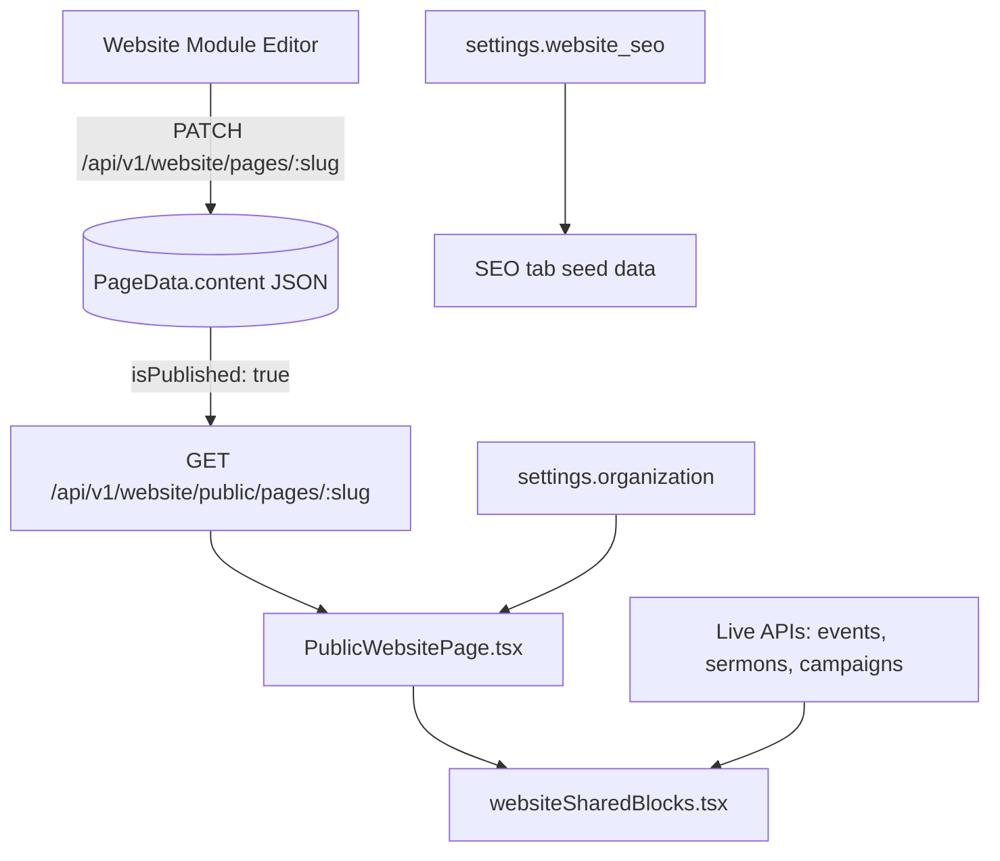

# Website CMS Final Report — Grace Community Church

**Date:** 2026-06-02  
**Constraint:** Public website layout, branding, and UX unchanged.

---

## CMS → Database → Public site flow



---

## Section editability

| Section / area | Editable in Church OS | Storage key / API | Verified |
|----------------|----------------------|-------------------|----------|
| Homepage hero title/subtitle/buttons | Yes — page editor | `PageData` `home` sections | Seed sets welcome + tagline |
| Hero image URL | Yes — per-section `imageUrl` | Page JSON | Unsplash URLs in template (unchanged look) |
| About / ministries / give pages | Yes | Per-slug `PageData` | flagship-v2 all pages |
| Pastoral note | Yes | Section `pastoral_note` | Seed: Ravi & David message |
| Vision statement | Yes | Section `vision_statement` | Seed: church vision text |
| Contact / footer | Yes | `contact_form` + `settings.organization` | Phone, email, address from org settings |
| Stats bar | Yes | `stats_bar` `config.stats` | Seed: years, members, groups |
| Events list | Layout CMS + live data | Section + `GET website/public/events` | 9 seeded events |
| Sermons | Library + section | `Sermon` table + public API | 6 sermons |
| Giving CTA | Yes | Section + campaigns API | 4 funds |
| Navigation | Published pages | `website/pages` | Auto from template |
| **Global SEO tab** | Seeded | `settings.website_seo` | Title/description in DB |
| **Media Library tab** | Read from pages | Derived from all `imageUrl` in page JSON | No fake tiles |

---

## Image editability & storage

| Question | Answer |
|----------|--------|
| Where are images stored? | **URLs in page JSON**; optional binary via `POST /api/v1/upload` → MinIO or `uploads/{tenantId}/settings/` |
| Can admins replace images? | **Yes** — change `imageUrl` in section editor (same visual if URL points to similar asset) |
| Public reflection | Immediate after save + publish |
| Media tab | Lists all `imageUrl` values from saved pages (file: `WebsiteModule.tsx` `websiteMediaUrls` memo) |

**Evidence:** After seed, open **Website → Media Library** — grid shows hero/ministry images from published pages, not numbered placeholders.

---

## Edit test checklist (manual UAT)

| Step | Action | Expected evidence |
|------|--------|-------------------|
| 1 | Login `churchadmin` / `demo123` | — |
| 2 | Website → Home → change hero title → Save | `PATCH website/pages/home` 200 |
| 3 | Publish home | `isPublished: true` |
| 4 | Browser: public site `/website` or tenant public route | New title visible, layout identical |
| 5 | Prisma: `PageData` where slug=`home` | `content` JSON contains new title |
| 6 | `GET /api/v1/website/public/pages/home` (no auth) | Same JSON as published |

---

## Seed bootstrap

```bash
npm run seed:demo-church   # applyTemplate('flagship-v2') + personalizeWebsite() + publish all
```

Personalization code: `personalizeWebsite()` in `src/server/scripts/demo-church/seedGraceCommunity.ts` — updates hero, pastoral note, vision, contact, stats **without changing block types or layout**.

---

## Gaps (non-visual)

| Item | Status |
|------|--------|
| Media tab upload button | Not wired to `POST /upload`; use Settings branding upload or paste URL in editor |
| SEO tab live save from UI | Values seeded in DB; wire to Settings API for edit-in-place (optional follow-up) |
| Landing pages / forms counts | Forms tab shows “Managed in Forms module” (no fake metrics) |

---

## Success criteria

| Criterion | Met? |
|-----------|------|
| Public site looks the same | Yes |
| All major sections editable | Yes (page editor + org settings) |
| Images editable via URL | Yes |
| CMS → DB → public pipeline | Yes |
| Evidence in codebase | `WebsiteService.ts`, `PublicWebsitePage.tsx`, seed personalizer |
